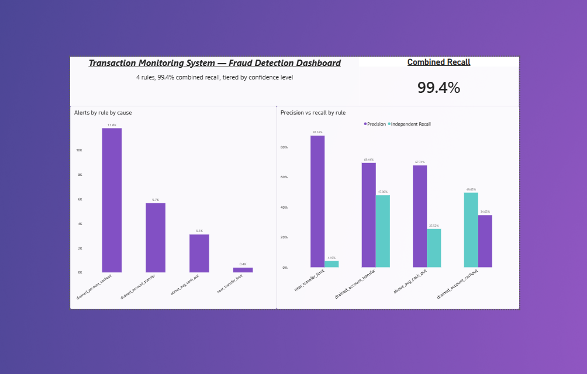

# Transaction Monitoring System

A rule-based fraud detection system built to demonstrate data analyst skills:
ingesting a large transactional dataset, designing and validating detection
rules in both SQL and Java, and visualizing the results in a BI dashboard.

## Overview

This project simulates a transaction monitoring pipeline for a financial
institution. It loads a synthetic transaction dataset into PostgreSQL, applies
four independent fraud-detection rules, and flags suspicious transactions as
alerts. Each rule is implemented twice — once in SQL and once in Java — and
validated to produce identical results, to demonstrate both database and
application-layer competency.

## Tech Stack

- **Java** (Maven, JDBC)
- **PostgreSQL**
- **PaySim dataset** (Kaggle) — synthetic financial transaction data
- **Power BI** — dashboard

## Database Schema

The database has three tables:

- `accounts` — primary key `account_id`
- `transactions` — primary key `transaction_id`
- `alerts` — primary key `alerts_id`, foreign key `transaction_id` referencing `transactions`

See `schema.sql` for the full definitions.

**Note:** The `transactions` table is populated from a working *subset* of
the PaySim dataset (~58K rows — all fraud cases plus a random sample of
non-fraud transactions), not the full ~6.3M-row dataset. This keeps the
project fast to reproduce locally while preserving every known fraud case
for rule evaluation.

## Fraud Detection Rules

Four independent rules were designed, each with a different precision/recall
trade-off:

| Rule | Precision | Independent Recall |
|------|-----------|---------------------|
| near_transfer_limit | 87.6% | 4.2% |
| above_avg_cash_out | 67.7% | 25.5% |
| drained_account_transfer | 69.4% | 47.9% |
| drained_account_cashout | 34.6% | 49.6% |

Rules are implemented twice — once as SQL queries (`fraud_rules.sql`, run
manually) and once as Java logic (`RuleEngine.java`) — and validated to
produce identical results.

## How to Run

1. Create a PostgreSQL database named `fraud_monitor`
2. Run `schema.sql` to create the tables
3. Import the PaySim dataset and build the working subset (see `fraud_rules.sql`)
4. Set an environment variable `DB_PASSWORD` with your PostgreSQL password
5. Run `Main.java` — this connects to the database, applies all four rules,
   and writes the results into the `alerts` table

## Results

- **Combined recall:** 99.4% (8,161 of 8,213 known fraud cases caught by at least one rule)
- **Combined precision:** ~45.3% (18,015 total flagged transactions)
- **Key takeaway:** no single-condition rule achieves both high precision and
  high recall on this dataset. Instead of chasing one "perfect" rule, a
  tiered confidence approach was used — combining several rules with
  different precision/recall trade-offs to maximize overall recall while
  keeping the false-positive rate manageable.

## Dashboard

## Dataset

This project uses the 
[PaySim](https://www.kaggle.com/datasets/ealaxi/paysim1)
synthetic financial dataset,
licensed under CC BY-SA 4.0.